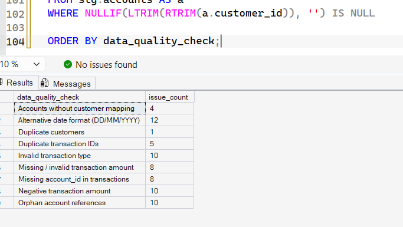
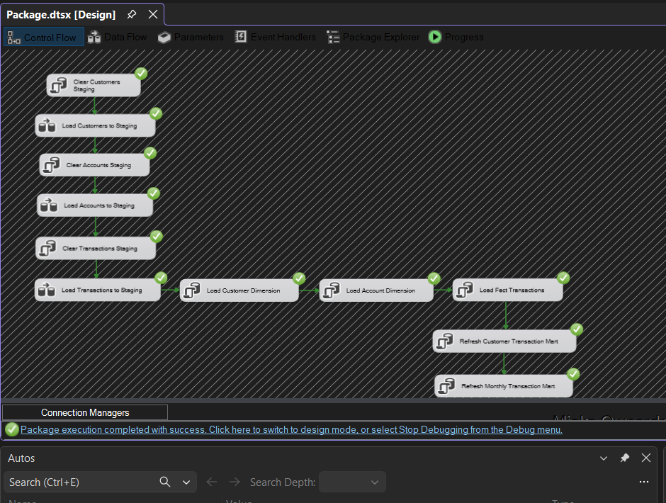
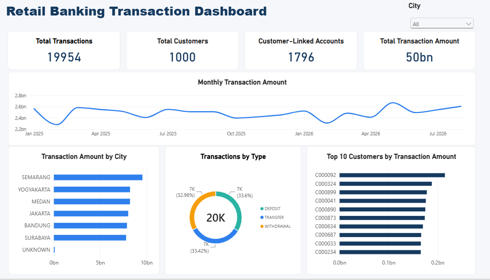
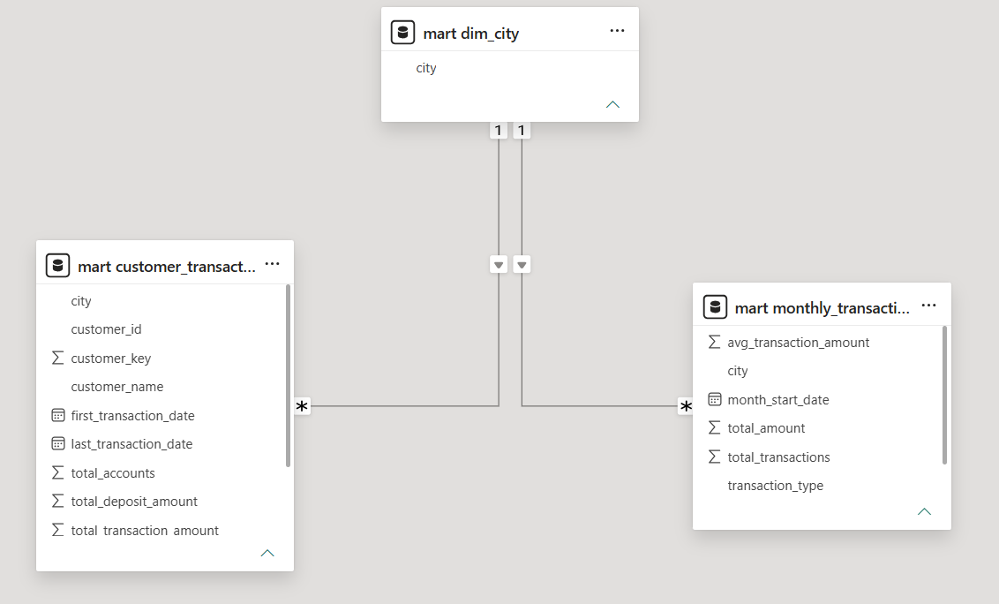

# Retail Banking Data Pipeline

A personal data engineering project that simulates a retail banking data pipeline from raw CSV files to a reporting dashboard.

The project uses SQL Server and SSIS to ingest and process customer, account, and transaction data, then prepares reporting tables that are visualized in Power BI.

All data used in this project is synthetic and created for learning purposes.

## Project Flow

```text
CSV Files
   ↓
Staging Tables
   ↓
Data Quality & Transformation
   ↓
Dimension & Fact Tables
   ↓
Data Marts
   ↓
Power BI Dashboard
```

## Tech Stack

- **SQL Server** — staging, data warehouse, and data marts
- **SSIS** — ETL orchestration and CSV ingestion
- **SQL** — data quality checks, cleansing, transformation, and loading
- **Power BI** — reporting and dashboard
- **Python** — synthetic data generation
- **Git & GitHub** — version control and documentation

## Dataset

The project uses three synthetic datasets:

| Dataset | Rows |
|---|---:|
| Customers | 1,001 |
| Accounts | 1,800 |
| Transactions | 20,005 |

The raw data intentionally contains several quality issues such as duplicate records, missing values, invalid references, inconsistent text values, and multiple date formats.

## Data Quality Checks

Some of the issues identified during profiling:

| Issue | Records |
|---|---:|
| Duplicate customers | 1 |
| Duplicate transaction IDs | 5 |
| Missing account IDs in transactions | 8 |
| Transactions with unknown account references | 10 |
| Missing or invalid transaction amounts | 8 |
| Negative transaction amounts | 10 |
| Invalid transaction types | 10 |
| Accounts without customer mapping | 4 |

The raw records are kept in the staging layer, while only valid transactions are loaded into the final fact table.

More details are available in [`docs/data_quality_findings.md`](docs/data_quality_findings.md).

### Data Quality Profiling

The raw datasets were profiled in SQL Server before transformation to identify duplicates, missing values, invalid references, and inconsistent values.



## Data Warehouse

The warehouse contains two dimensions and one fact table:

- `dw.dim_customer`
- `dw.dim_account`
- `dw.fact_transaction`

After cleansing and validation, **19,954 valid transactions** are loaded into the fact table.

Two reporting marts are also created:

- `mart.customer_transaction_summary`
- `mart.monthly_transaction_summary`

A shared `mart.dim_city` table is used in Power BI so the city filter can work across both reporting marts.

## SSIS Pipeline

The ETL workflow is orchestrated using SSIS.

```text
Clear Customers Staging
        ↓
Load Customers to Staging
        ↓
Clear Accounts Staging
        ↓
Load Accounts to Staging
        ↓
Clear Transactions Staging
        ↓
Load Transactions to Staging
        ↓
Load Customer Dimension
        ↓
Load Account Dimension
        ↓
Load Fact Transactions
        ↓
Refresh Reporting Marts
```

The package can be rerun without duplicating existing warehouse records.
The pipeline is orchestrated using SSIS to load raw CSV files into staging tables and continue the transformation process into the dimensional warehouse and reporting marts.



## Power BI Dashboard

The final dashboard includes:

- Total transactions
- Total customers
- Customer-linked accounts
- Total transaction amount
- Monthly transaction trend
- Transaction amount by city
- Transaction breakdown by type
- Top 10 customers by transaction amount
- City filtering



## Power BI Data Model

A shared city dimension is used to filter both reporting marts consistently.



## Repository Structure

```text
retail-banking-data-pipeline/
├── data/
│   └── raw/
├── docs/
├── python/
├── sql/
├── ssis/
├── images/
├── Retail_Banking_Dashboard.pbix
└── README.md
```

## Notes

This project was created as a personal learning project to practice SQL, ETL development with SSIS, dimensional modeling, data quality handling, and Power BI reporting.

The dataset is fully synthetic and does not contain real customer or banking information.
